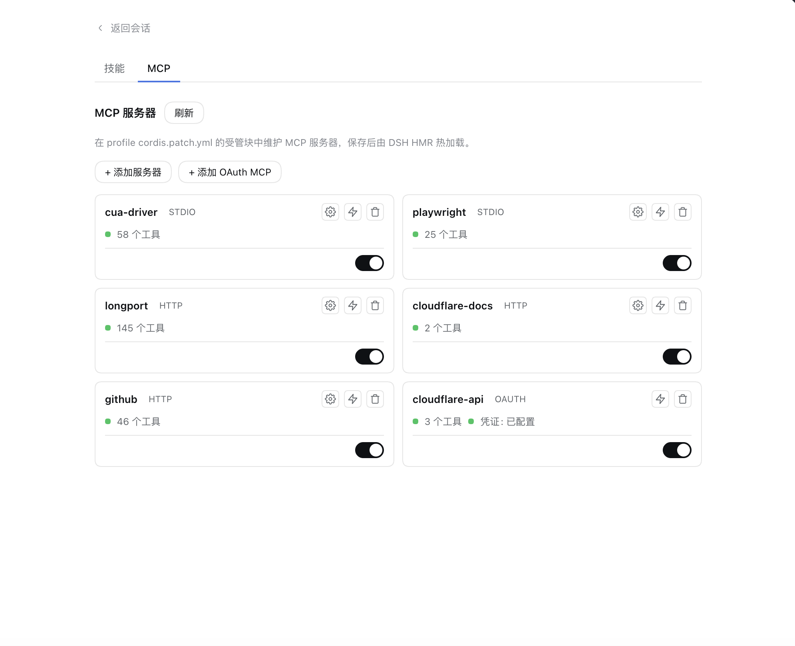
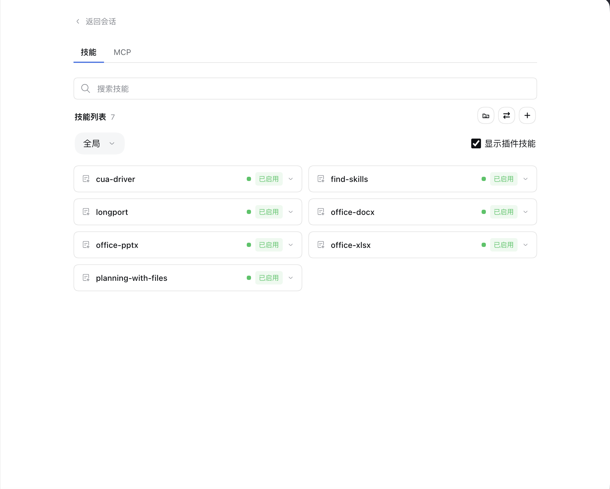

# dsh-mcp-unified-panel

<div align="center">

# 能力库 (Unified MCP & Skill Hub)

**DeepSeek Harness 一站式能力管理中心 —— 全功能 MCP 服务器管理、官方/第三方特征识别、原生 OAuth 2.1 浏览器授权、技能热管理。**

[中文](#-中文) · [English](#-english)

[](LICENSE)
[](https://github.com/deepseek-ai/deepseek-harness)
[](#)

<br /><br />


<br /><br />


</div>

---

## 🇨🇳 中文

### 📖 为什么需要它（解决的痛点）

在 DeepSeek Harness 生态中，管理 MCP 与技能一直面临三大痛点：

1. **官方 MCP 客户端不支持 OAuth 2.1 鉴权**：
   官方 `@deepseek-ai/dsh-mcp-client` 仅支持 `stdio` 与静态 Token 请求头，无法完成类似 Cloudflare、GitHub Copilot 等现代 MCP 所需的 OAuth 2.1 + PKCE 浏览器交互授权。
2. **上游面板包名白名单封杀第三方**：
   上游面板在 4 处核心逻辑中写死了 `@deepseek-ai/dsh-mcp-client` 包名白名单，导致所有第三方客户端挂载的行被整行丢弃，用户不仅在界面上看不到，更无法进行可视化启停与管理。
3. **插件碎片化与设置页割裂**：
   为了同时实现 MCP 运维、第三方支持与技能管理，用户不得不同时安装 `dsh-skill-mcp-panel`、`dsh-plugin-manager`、`dsh-oauth-mcp-client` 多个插件。不同插件各说各话，并在设置页留下一堆失效或多余的 Tab，极易产生并发写入冲突。

### 🌟 核心特性与能力

`dsh-mcp-unified-panel` 以 **`dsh-skill-mcp-panel@2.1.5` 为底座**，并深度融合 **`@dsh-external/dsh-oauth-mcp-client` 的底层鉴权驱动**，打造出真正的 **All-in-One 开箱即用**能力管理方案：

- 🚀 **All-in-One 架构，零外部依赖**：
  内置完整的 OAuth 2.1 客户端驱动（子路径导出 `dsh-mcp-unified-panel/oauth-client`）。用户**只需安装本插件一个包**，即可获得全量功能，设置面板干干净净。
- 🔍 **特征识别替代包名白名单**：
  采用结构化判据（`id` + `config.serverName` + 通讯协议特征），智能识别官方与第三方（如 OAuth）MCP 行。所有有效行全部同屏可见，并支持一键启停。
- ⚡ **原生 OAuth 2.1 浏览器授权**：
  支持直接在面板通过「+ 添加 OAuth MCP」一键新增连接，自动派生 `credentialRef` 并触发系统默认浏览器完成 PKCE 授权，自动落盘凭证。
- 🛡️ **YAML 字节保留与安全隔离**：
  - 官方外部行原地安全更新与启停，严格校验字段，`!!js` 动态表达式（如 Bearer Token 环境变量）百分之百无损往返。
  - 第三方行严格隔离，只允许翻动 `disabled` 开关与一键卸载，绝不套用官方重写 Schema，杜绝破坏用户私有客户端配置。
- 🎨 **精简现代的界面交互**：
  - 左侧侧边栏入口统一为「**能力库**」。
  - 卡片右上角集成 ⚙️ 编辑、⚡ 连通性测试（真实检测并列出激活工具）、🗑️ 卸载图标（带防误触二次确认）。
  - 采用 DSH 官方 `@deepseek-ai/dsh-client-ui-primitives` 原生组件，Switch 开关与 Checkbox 复选框质感与官方完全一致。
- 📦 **完整的技能管理能力**：
  保留了上游全部成熟的技能目录浏览、启用/停用、删除、新建导入、多工作区迁移与分组功能。

---

### 📦 安装指南

#### 方式一：DSH 插件市场安装（推荐）
在 DSH 插件市场中搜索 **`dsh-mcp-unified-panel`** 或 **`能力库`**，点击安装即可。

#### 方式二：命令行安装
```bash
# 在你使用的 profile 下安装（以 desktop profile 为例）：
dsh plugin --profile desktop add dsh-mcp-unified-panel
```

*安装后重启 DSH 桌面端即可在侧边栏看到「能力库」入口。*

---

### 🛠️ 命令行支持 (CLI)

插件内置统一的 CLI 工具 `dsh-mcp-unified`：

```bash
# 查看所有 MCP 服务器状态（含官方受管、外部行、第三方 OAuth）
dsh-mcp-unified mcp list --profile desktop

# 启停任一 MCP 服务器（支持官方与第三方）
dsh-mcp-unified mcp enable <serverName> --profile desktop
dsh-mcp-unified mcp disable <serverName> --profile desktop

# 新增 OAuth MCP 连接并触发鉴权
dsh-mcp-unified mcp oauth-add --name cloudflare-api --url https://mcp.cloudflare.com/mcp --profile desktop

# 卸载指定 OAuth MCP 连接
dsh-mcp-unified mcp oauth-remove <serverName> --profile desktop
```

---

### 🙏 致敬与开源底座

本项目站在巨人的肩膀上：
- 感谢 **`dsh-skill-mcp-panel`** 提供的强大侧边栏面板与技能管理框架。
- 感谢 **`@dsh-external/dsh-oauth-mcp-client`** 提供的优雅的 MCP OAuth 2.1 协议实现。

---

## 🌐 English

### 📖 Motivation & Problem Statement

In the DeepSeek Harness ecosystem, managing Model Context Protocol (MCP) servers and Agent Skills has long suffered from key limitations:

1. **Official Client Lacks OAuth 2.1 Support**:
   The official `@deepseek-ai/dsh-mcp-client` only supports `stdio` and static HTTP headers. It cannot handle modern OAuth 2.1 + PKCE browser authorization required by services like Cloudflare or GitHub Copilot.
2. **Upstream Whitelist Excludes Third-Party Clients**:
   The upstream panel strictly hardcodes `@deepseek-ai/dsh-mcp-client` in its whitelist across four propagation points, dropping all third-party and OAuth-based lines entirely from the UI.
3. **Plugin Fragmentation & Redundancy**:
   Users previously had to juggle `dsh-skill-mcp-panel`, `dsh-plugin-manager`, and `dsh-oauth-mcp-client` concurrently, causing configuration conflicts, UI clutter, and orphaned settings tabs.

### 🌟 Key Features

**`dsh-mcp-unified-panel`** is built upon **`dsh-skill-mcp-panel@2.1.5`** and powered by **`@dsh-external/dsh-oauth-mcp-client`'s** OAuth engine, providing a truly unified, **All-in-One** experience:

- 🚀 **All-in-One Standalone Architecture**:
  The complete OAuth MCP client driver is built-in (`dsh-mcp-unified-panel/oauth-client`). Users install only **this single package** to get full functionality without extra dependencies.
- 🔍 **Feature-based Recognition**:
  Replaces rigid package whitelisting with structured feature detection. Both official and third-party MCP servers are visible and controllable side-by-side.
- ⚡ **Interactive OAuth 2.1 Authentication**:
  Add OAuth MCP endpoints with a single click. Automatically coordinates PKCE loops, opens your default browser for authorization, and persists tokens securely.
- 🛡️ **Byte-Preserving YAML Safety**:
  - In-place updates for official MCPs while guaranteeing `!!js` expressions (such as Bearer environment variables) are preserved intact.
  - Safe isolation for third-party rows: only toggling and uninstallation are permitted, never overwriting third-party definitions with official schemas.
- 🎨 **Clean & Unified Native UI**:
  - Sidebar entry is cleanly labeled **"能力库" (Capability Hub)**.
  - Card top-right houses ⚙️ Edit, ⚡ Live Test (probes and lists active tools), and 🗑️ Uninstall with confirmation.
  - Toggle switches and checkboxes use native `@deepseek-ai/dsh-client-ui-primitives` components for a 100% consistent look and feel.
- 📦 **Full Skills Management Suite**:
  Inherits complete catalog inspection, workspace migration, and grouping features for Agent Skills.

---

### 📦 Installation

```bash
# Install into your target profile (e.g., desktop):
dsh plugin --profile desktop add dsh-mcp-unified-panel
```

*Restart DeepSeek Harness after installation to activate the panel in your sidebar.*

---

### 📄 License

[MIT](LICENSE)
